# Recipe Box

Hungry? [Recipe Box](https://recipe-box-theopmw.herokuapp.com/) has you covered! 


## **Site Goals**

This project is part of my [Code Institute](https://codeinstitute.net/) Full Stack Software Development Diploma, specifically for the **Data Centric Development** Module. The objective of this project is to "build a full-stack site that allows users to manage a common dataset about a particular domain" using **CRUD** operations - **C**reate, **R**ead, **U**pdate and **D**elete.

I love to cook and have various recipes all over the place (in folders or books around the kitchen, saved online, printed, in emails etc) most of which I have modified in some way. Creating this project is a great way to finally store all these recipes in one place in a way that can easily be shared with others. It also allows other users to share and store recipes securely.

The site has been designed to be mobile first and easily accessible and responsive on a range of devices. This is to allow users to easily look up recipes on any device, wherever they are.

If the site is successful and generates interest and traffic, there is scope to substantially increase the scale of the site, it is anticipated that the site could be expanded to include the following features:

- Add a way for users to like/favourite a recipe, which will then save it to their profile page
- Add a way for users to rate recipes, with a star rating system
- Add a way for users to be able to comment on recipes
- Add ability for users to generate an easily printable version of a recipe
- Add a way for users to easily be able to share recipes on social media or via email
- Add functional newsletter to email users weekly/monthly recipes

## **UX**

### User Stories

**As a user, I would like to:**

- [x] Access the site from mobile, tablet and desktop devices
- [x] Easily register to have my own profile   
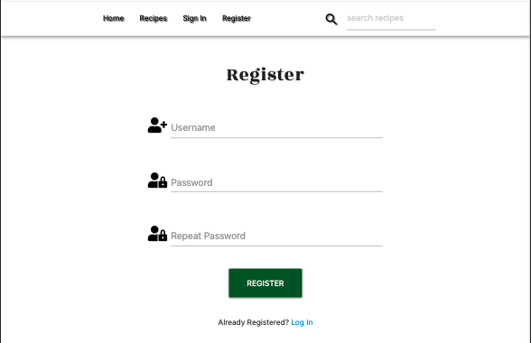
- [x] Easily log in to my profile   
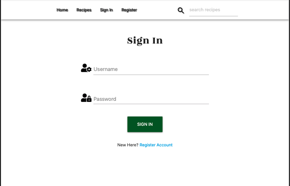
- [x] Easily log out of my profile   
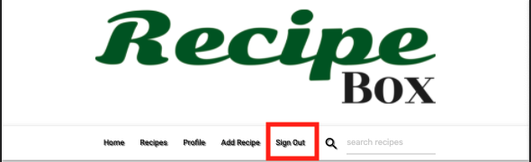
- [x] Receive feedback when I Log In   

- [x] Receive feedback when I Log Out    
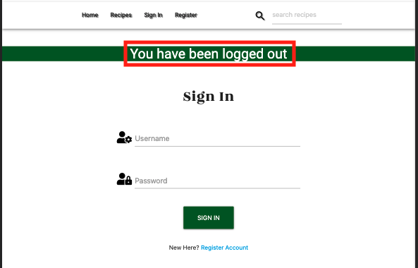
- [x] Be able to browse all recipes submitted to the website   

- [x] Search recipes by ingredient, name or category   
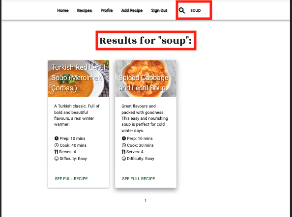
- [x] Add my own recipes   
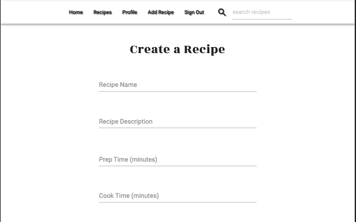
- [x] Edit my own recipes   
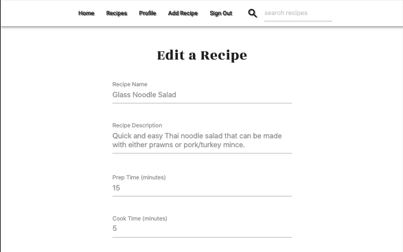
- [x] Delete my own recipes   
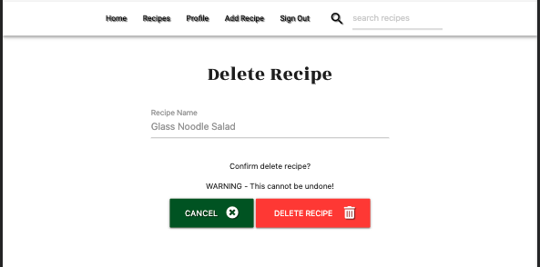
- [x] Be given feedback when I have added, edited, or deleted a recipe   
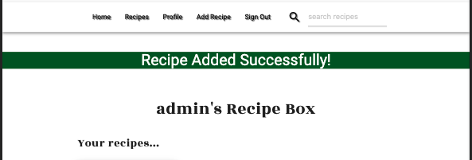
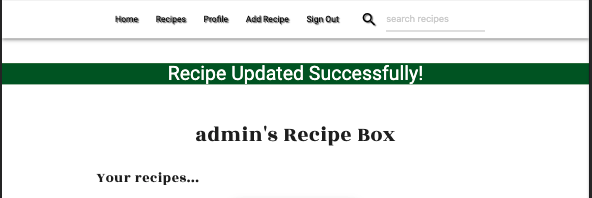
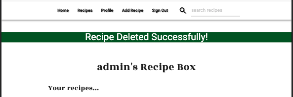
- [x] Have easy access to the recipes I have personally submitted   
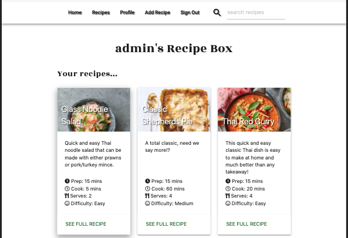

**As an admin I would like to do all of the above and additionally:**

- [x] Access, edit and delete ALL recipes   
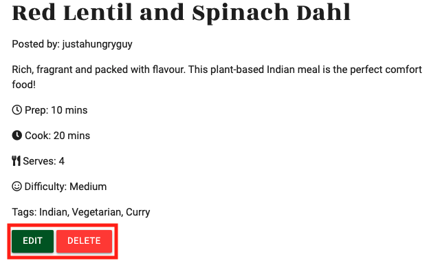

### Developer goals

* Create a easy to use, online cookbook where users can utilise CRUD (Create, Read, Update, Delete) functionality to post, view, edit and delete recipes
* Allow only the owner of the recipe or an admin/superuser the ability to edit or delete a recipe.
* Provide users with the ability to search recipes by name, ingredient or tag.
* Further develop understanding of Python, Flask, Jinja & MongoDB (non-relational database).
* Improve knowledge of HTML, CSS & JavaScript.
* Use Materialize CSS to develop a website.
* Use Heroku to deploy the app.

### Wireframes

Research was conducted by browsing a wide range of recipe sites and looking at their layout, overall design and functionality. The wireframes were used as a guide throughout the design process and some minor deviations were made, most notably adapting the top recipes on the home page to a range of recipe cards rather than a carousel to improve UX, allow the user to access important information more quickly and keep the overall design and feel in line with the rest of the site.

[Wireframes](assets/wireframes/recipe_box_wireframes.pdf)

### Design

The site takes inspiration form similar sites such as [BBC Good Food](https://www.bbcgoodfood.com/), [Olive Magazine](https://www.olivemagazine.com/) and [Delicious Magazine](https://www.deliciousmagazine.co.uk/). The aim was to keep the site aesthetic clean and simple to provide a positive UX and keep the focal point on the food and ensure recipe instructions are clear and easy to follow.

#### Colour Scheme

Dark green (#1b5e20), black (#00000) and white (#fffff) were the 3 colours used throughout the site. These colours were chosen as they complement each other well and create a clean UI.

### Typography

Sonsie One and Rozha One were the two fonts used in the brand logo as they complement each other well. 

Rozha One was used throughout the site for page headings and sub-headings as it is a bold font, is clear to read, and ties the headings in nicely with the branding of the site.

Roboto was used for the main text of the site as it is very clear and legible. This font was used for the main blocks of text as it is very easy to read.

### Imagery

The imagery used throughout the site has been taken from a range of online recipe sites.

## Features

### **Page Features**

### Consistent Site Features and Components

- All pages of the site contain the same **Header** and **Footer** components.

- **Header** 
    - The Header consists of the site logo in the centre of the page, with the navbar menu items situated underneath it.

    - The navigation menu (situated beneath the site logo on all pages), was built using the Materialize CSS **Navbar** component It consists of the following menu items (aligned left).   
        - **If no user signed in:**  Home, Recipes, Sign In, Register   

        - **If User Signed in:** Home, Recipes, Profile, Add Recipe, Sign Out

    - Aligned to the right of the navigation menu is a search bar that allows users to search for recipes by name, ingredient or tag.

    - The navigation menu is condensed into a hamburger icon on tablet devices and smaller, to provide positive UX and not overcrowd the UI.

- **Footer**
    - The footer consists of a newsletter signup button that launches a modal containing the signup form and links to Recipe Box social media (note that as Recipe Box is for educational purposes only and therefore does not have social media, the links redirect to the specific platform home page)

    - Below this, the site copyright information is displayed

### Home Page (available to all users, no need to register account)

- The **Home Page** features 6 Materialize cards displaying the top 6 recipes based on user views. Each time a user clicks on a recipe card to view the full recipe, a view is added to the DB and the recipes with the most views are rendered on the page.

- Below the top 6 recipes is a "MORE RECIPES HERE" button that redirects the user to the Recipes Page, which features all recipes stored on the site (see below).

### Recipes Page (available to all users, no need to register account)

- The **Recipes Page** displays Materialize cards featuring all recipes on the site. This section features pagination to display 6 recipes per page. 

- The Materialize cards feature the following recipe information:

    - An image of the recipe
    - The recipe name/title
    - The recipe description
    - The recipe prep time
    - The recipe cook time
    - The recipe servings
    - The recipe difficulty
    - A link to view the full recipe

- The pagination is designed to only show the left chevron when the page is greater than 1 and the right chevron when on any page except the last. The active page is also made clear to the user so they can easily see which page they are currently viewing.

### Recipe Page (available to all users, no need to register account)

- Once a user clicks the **"SEE FULL RECIPE"** link at the bottom of a recipe card, the **Recipe Page** is launched to display the full recipe instructions.

- The page features the following recipe information:

    - An image of the recipe
    - The recipe name/title
    - The recipe description
    - The recipe prep time
    - The recipe cook time
    - The recipe servings
    - The recipe difficulty
    - If the user in session created the recipe or the admin user is logged in, **EDIT** and **DELETE** buttons are displayed to allow the user/admin to either edit or delete the recipe (these links will be covered in further detail below).
    - The recipe instructions
    - The recipe method

### Sign In Page (available to all users, no need to register account)

- The **Sign In** page features a form, handled by [WTForms](https://wtforms.readthedocs.io/en/2.3.x/) (covered in further detail below) and styled using [Materialize CSS](https://materializecss.com/).

- The form features a **Username** field (WTForms StringField), a **Password** field (WTForms PasswordField) and a **Sign In** button (WTForms SubmitField).

- The form checks the username/password combination and will redirect to the Sign In page if they do not match a document from the **users collection** in the DB, a flash message is also displayed to provide feedback to the user: "Invalid username/password combination. Please try again."

- If the user does not have an account, there is a link below the Sign In button to take them to the **Register Page**.

- After successful registration, the user is redirected to their profile page and a flash message is displayed to welcome them to the site: "Welcome, \<username>".

### Register Page (available to all users, no need to register account)

- The **Register Page** features a form, handled by [WTForms](https://wtforms.readthedocs.io/en/2.3.x/) (covered in further detail below) and styled using [Materialize CSS](https://materializecss.com/).

- The form features a **Username** field (WTForms StringField), a **Password** field (WTForms PasswordField), A **Repeat Password** field (WTForms PasswordField), and a **Register** button (WTForms SubmitField).

- The form checks if the username already exists in the DB and if it does, will redirect back to the Register page and flash a message to the user to provide feedback: "Sorry, that username is already taken. Please try another".

- The form uses WTForms to check if the passwords match and if they don't will display an error message to the user: "Passwords do not match, please try again".

- If the user already has an account, there is a link below the Register button to take them to the **Sign In Page**. 

- After successful registration, the user is redirected to their profile page and a flash message is displayed to welcome them to the site: "Welcome, \<username>".

### Profile Page (only available to registered users)

- Upon successful login, the user is directed to their **Profile Page**.

- On login, there is a flash message displayed on the profile page to welcome the user to the site: "Welcome, \<username>".

- The Profile Page features a page heading "\<username>'s Recipe Box" with a sub-heading "Your Recipes..."

- Below these headings Materialize cards displaying the recipes submitted by the user in session (same layout as described in "Recipes Page" section above).

### Add Recipe Page (only available to registered users)

- The **Add Recipe Page** features a form, handled by [WTForms](https://wtforms.readthedocs.io/en/2.3.x/) (covered in further detail below) and styled using [Materialize CSS](https://materializecss.com/).

- The form features the following fields:
    - **Recipe Name**: WTForms StringField, styled with a [Materialze input field](https://materializecss.com/text-inputs.html)
    - **Recipe Description**: WTForms TextAreaField, styled with a [Materialze text area input field](https://materializecss.com/text-inputs.html)
    - **Prep Time**: WTForms StringField, styled with a [Materialze input field](https://materializecss.com/text-inputs.html)
    - **Cook Time**: WTForms StringField, styled with a [Materialze input field](https://materializecss.com/text-inputs.html)
    - **Servings**: WTForms SelectField, styled with a [Materialze select field](https://materializecss.com/select.html)
    - **Tags**: WTForms StringField, styled with a [Materialze input field](https://materializecss.com/text-inputs.html)
    - **Difficulty**: WTForms SelectField, styled with a [Materialze select field](https://materializecss.com/select.html)
    - **Image Link**: WTForms StringField, styled with a [Materialze input field](https://materializecss.com/text-inputs.html)
    - **Ingredients**: WTForms TextAreaField, styled with a [Materialze text area input field](https://materializecss.com/text-inputs.html)
        - Each ingredient is to be input on it's own line (instruction given to user in the form input label) and the splitline() method is applied in the recipe.html template to render the ingredient list correctly in the DOM, with each ingredient on its own line.
        - This field has been designed as a text area to provide a simple, intuitive UX. By recording the information in this way, the user can easily edit the information and there are less keystrokes required to input the information. The idea was for the field to act in a similar way to a traditional word processor so that is is familiar to the user.
    - **Method**: WTForms TextAreaField, styled with a [Materialze text area input field](https://materializecss.com/text-inputs.html)
        - Each step is to be input on it's own line (instruction given to user in the form input label) and the splitline() method is applied in the recipe.html template to render the steps correctly in the DOM, with each step on its own line.
        - This field has been designed as a text area to provide a simple, intuitive UX. By recording the information in this way, the user can easily edit the information and there are less keystrokes required to input the information. The idea was for the field to act in a similar way to a traditional word processor so that is familiar to the user and easy to understand.
    - **Add Recipe** WTForms SubmitField, styled with a Materialize button

- The validation of all fields is handled by [WTForms Built-in Validators](https://wtforms.readthedocs.io/en/2.3.x/validators/#built-in-validators) and error messages are displayed to the user if their input does not meet the field criteria.

- After a recipe has been successfully added to the DB, the user is redirected to the Profile Page and a flash message is displayed to provide feedback: "Recipe Added Successfully".

### Edit Recipe Page (only available to user that owns the recipe and admin user)

- The **Edit Recipe Page** behaves in the exact same way as the Add Recipe Page, other than that the form fields are already pre-filled with the recipe information the user provided when adding/previously editing the recipe, this had been pulled from the recipe document in the DB.

- Beneath the form fields are 2 Buttons:
    - A **"Cancel"** button which redirects the user back to the Recipes Page.
    - An **"Update Recipe"** button (WTForms SubmitField) for the user to update there changes to the recipe.
   

### Delete Recipe Page (only available to user that owns the recipe and admin user)

- The **Delete Recipe Page** features the name of the recipe to be deleted, followed by a message to warn the user that this action cannot be undone. This is followed by 2 buttons:
    - A **"Cancel"** button to cancel the delete process and redirect the user back to the Recipes Page
    - A **"Delete Recipe"** button, to confirm and delete the recipe. This redirects the user to their Profile Page and flashes a message to confirm the recipe has been deleted.

### Search Page (available to all users, no need to register account)

- The **Search Page** acts in a similar way to the all recipes page, but only displays recipes that match the search query.
- It also utilises Materialize cards to display the recipes and paginates the results if there are more than 6 results for the specific search query.

### **Responsive Design Features**

### Responsive for Device Size

The Materialize CSS framework was used to ensure the site is responsive on all device sizes.

#### **Mobile Devices**

- On mobile devices, the Materialze Grid System was utilised to stack information vertically on small device sizes to provide positive and efficient UX and allow information to be read easily by the user. The navigation controls are launched though a hamburger icon/menu toggler to provide a clean UX.   

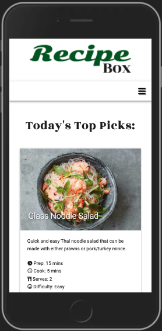

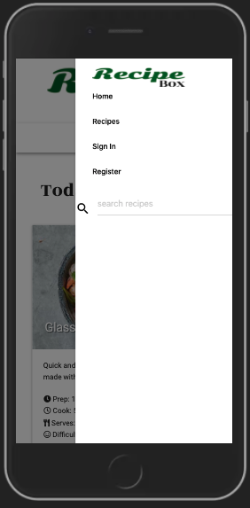

#### **Tablet Devices**

- At tablet size, the Materialze Grid System was used to display 2 recipe cards per row. The hamburger icon/menu toggler was retained to keep the UI clean and clear.

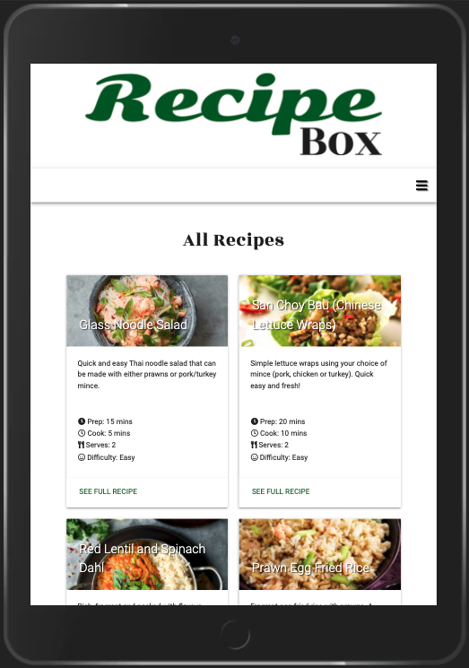

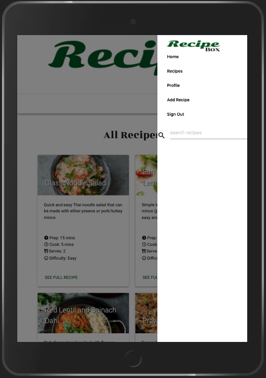

#### **Desktop Devices**

At desktop size, the Materialze Grid System was used to display 3 recipe cards per row.

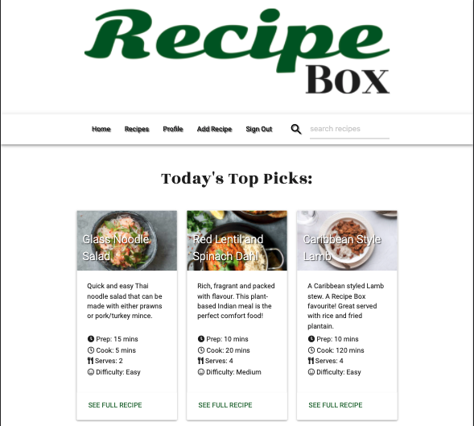

## Information Architecture

This site utilises [MongoDB Atlas](https://www.mongodb.com/) for data storage.

See below for the data schema of the site:

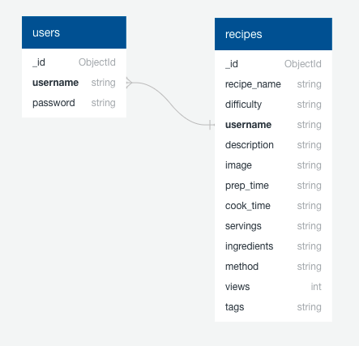

There is scope to further expand this in the following ways:

## Technologies Used

### Languages Used

* HTML
* CSS
* JavaScript
* Python

### Frameworks, Libraries and Programs Used

* [Gitpod](https://gitpod.io/) - **Gitpod** was used for the IDE while building the website.
* [Git](https://git-scm.com/) - **Git** was used for version control by utilizing the Gitpod terminal to commit to Git and Push to GitHub.
* [GitHub](https://github.com/) - **GitHub** is used to store the projects code after being pushed from Git.
* [Heroku](https://id.heroku.com/login) - **Heroku** was used as the deployment platform for this project.
* [Materialize CSS 1.0.0](https://materializecss.com/) - **Materialize CSS** was used to assist with the responsiveness and styling of the website.
* [JQuery](https://jquery.com/) - **JQuery** JavaScript library was used to simplify JavaScript code.
* [Flask](https://flask.palletsprojects.com/en/2.0.x/) - **Flask** WSGI web application framework was used to simplify the application build.
    * [Jinja](https://jinja.palletsprojects.com/en/3.0.x/) - **Jinja** templating engine was used to was used for templating and simplifying the design process.
    * [Flask-WTForms](https://wtforms.readthedocs.io/en/2.3.x/) - **Flask-WTForms** was used as the flexible forms validation and rendering library (discussed in further detail below).
    * [Autopep8](https://pypi.org/project/autopep8/) - **Autopep8** used to format Python code to be PEP8 compliant.
* [Mongo DB](https://www.mongodb.com/) _ **Mongo DB** was used to store the data for the project.
* [Favicon.io](https://favicon.io/) - **Favicon.io** was used to create the favicon for the website.
* [Font Awesome](https://fontawesome.com/) - **Font Awesome** was used on all pages throughout the website to add icons for aesthetic and UX purposes.
* [Google Fonts](https://fonts.google.com/) - **Google Fonts** were used to import the 'Sonsie One', 'Rozha One and 'Roboto' fonts into the style.css file to style the fonts used on all pages of the project.
* [Balsamiq](https://balsamiq.com/) - **Balsamiq** was used to create the wireframes during the design process.
* [Web Formatter](https://webformatter.com/) - **Web Formatter** was used to beautify code.
* [Am I Responsive](http://ami.responsivedesign.is/) - **Am I Responsive** was used to test page layouts during the build process.

### Notes on Flask-WTForms

After some research, Flask-WTForms was chosen to simplify form generation and validation (e.g. avoidance of Cross-Site Request Forgery (CSRF)) for the site.

The following articles helped with the decision and to develop a better understanding of the uses and capabilities of Flask-WTForms:

[BetterProgramming](https://betterprogramming.pub/how-to-use-flask-wtforms-faab71d5a034)

[OWASP.org](https://owasp.org/www-community/attacks/csrf)

## Testing

Detailed testing information can be found in separate [TESTING.md](https://github.com/theopmw/recipe-box/blob/master/TESTING.md) file.

## Git and Version Control

This project is managed using Git version control system.

For each meaningful change made, Git is used to stage, commit and push the files to the [Recipe Box repository](https://github.com/theopmw/recipe-box) on GitHub.

For each change made, the following process was followed, a description of the different commands used throughout the project and their uses has also been provided:

* Staging:
    * When a file has been modified and it must be marked to go it to your next commit.
    * To check the status of your Git repository, including files that are not staged and files that are staged, the ```git status``` command is used.
    * To stage modified files, the ```add``` command is used, which can be run multiple times before a commit. 
        * You can either specify the specific file with ```add```. For example: "```git add my_file.html```". Or add stage all files in the current directory with "```git add .```".
        * You can also remove files from staging without losing the changes made to the file using ```reset```. For example: "```git reset my_file.html```".
* Committing:
    * Once updates have been staged, you are ready to commit them, which will record the changes made to the repository.
    * Run the ```commit``` command to commit staged files, a meaningful commit message must be included to track commits. For example: "```git commit -m "Meaningful commit message" "```.
    * You can stage and commit all tracked files with a condensed message: "```git commit -am "Meaningful commit message" "```.
    * The commit message can be modified using the ```--amend``` flag. For example: "```git commit --amend -m "New commit message""```.
* Pushing:
    * Once files have been committed and a commit message has been provided, they are pushed to the remote repository using the ```push``` command.
    * "```git push```" will transmit the local commits to the remote repository.

Git branching was also utilised to isolate the production of new features and merge them with the master branch throughout the development cycle of the project.

* Branches
    * New branches were created using ```git branch new-branch```.
    * ```git switch new-branch``` was used to switch to the new branch.
    * A feature was then worked on in the new branch and modifications were staged, committed and pushed.
    * ```git switch master``` was used to switch back to the master branch.
    * The branch was then merged with the master using ```git merge new-branch```
    * When the branch had been merged with the master and was no longer needed, ```git branch -d new-branch``` was used to delete the branch.

Parts of this section used the following article for reference: [How To Use Git: A Reference Guide](https://dev.to/digitalocean/how-to-use-git-a-reference-guide-6b6).

## Deployment

### Heroku

Heroku was used as the deployment platform for this site using the following steps:

* Within the IDE, set up files needed to run the app:
    * Tell Heroku which applications and dependencies are required to run our app by typing ``pip3 freeze --local > requirements.txt`` into the terminal.
    * Create a Procfile to tell Heroku which file runs the app, and how to run it by typing ``echo web: python app.py > Procfile`` into the terminal.
* Check that the files have been set up correctly and that the requirements.txt file contains the dependencies that are needed.
* Check the Procfile has been set up correctly (it can add a blank line at the bottom and this can sometimes cause problems when running the app on Heroku, so remove that and save the file before proceeding).
* Log into Heroku and 'Create new app' from the Dashboard. 
    * The app name must be unique.
    * When choosing a region, select the region closest to you.
* There are several different options to create a new app for this project, for the purpose of this project, Automatic Deployment from our GitHub repository was set up.
    * To do this, under 'Deployment method' select the GitHub option.
* Make sure your GitHub profile is displayed, add your repository name, then click 'Search'.
* Once it finds the repo, click 'Connect' to connect to this app.
* Click on the 'Settings' tab for the app, and then click on 'Reveal Config Vars' in order to securely tell Heroku which variables are required.
* The env.py file contains a few different variables (make sure not to include any "quotes" for the key, or the value)
    * Add all the variables from the env.py file to the Config Vars in Heroku.
* Before deploying, ensure the requirements.txt and Procfile have been pushed to the repository.
* Return to the Heroku 'Deploy' tab and click on 'Enable Automatic Deployment'.
* Ensure the GitHub branch is set to master and click the 'Deploy Branch' button.
* Heroku will now receive the code from GitHub and start building the app using the required packages.
* Once complete, 'Your app was successfully deployed' will be displayed.
* Click 'View' to launch the app.

### Forking the GitHub Repository

By forking the GitHub Repository we make a copy of the original repository on our GitHub account to view and/or make changes without affecting the original repository by using the following steps:

1. Log in to GitHub and locate the [GitHub Repository](https://github.com/theopmw/recipe-box)
2. At the top of the Repository (not top of page) just above the "Settings" Button on the menu, locate the "Fork" Button.
3. You should now have a copy of the original repository in your GitHub account.

### Making a Local Clone

1. Log in to GitHub and locate the [GitHub Repository](https://github.com/theopmw/recipe-box).
2. Under the repository name, click "Clone or download".
3. To clone the repository using HTTPS, under "Clone with HTTPS", copy the link.
4. Open Git Bash.
5. Change the current working directory to the location where you want the cloned directory to be made.
6. Type "git clone", and then paste the URL you copied in Step 3:

```
$ git clone https://github.com/theopmw/recipe-box
```

7. Press Enter and your local clone will be created.

## Credits

### Code

* My Mentor, Spencer Barriball for providing support, guidance and inspiration - especially regarding the use of Flask-WTForms.
* [Materialize CSS](https://materializecss.com/): Materialize Library used throughout the project for the Materialize Grid System, to make the site responsive and for select Materialize Components.
* Various online resources utilised for guidance throughout the project - [CSS Tricks](https://css-tricks.com/), [Stack Overflow](https://stackoverflow.com/), [W3 Schools](https://www.w3schools.com/).
    * All code modified from external sources to suit the needs of the project are attributed via comments above the code throughout the project.
* The Code Institute Tutor Team for assistance with the creation of the site.

### Content

* All content was written by the developer.

#### Favicon: 

* The page favicon was generated using https://favicon.io/.

#### Imagery:

* All imagery was sourced from a wide variety of recipe sites.

### Acknowledgements

* My Mentor, Spencer Barriball, for continuous feedback, support, guidance and inspiration.
* Code Institute Tutor Support, for their continuous support and guidance.
* Code Institute Assessment team, for providing insightful feedback, reducing any re-occurring errors that may have carried over from my MS1 project, [Done London](https://github.com/theopmw/Done-London) and MS2 project, [Top Spots London](https://github.com/theopmw/Top-Spots-London).

### Disclaimer

All content on this site was developed for educational purposes only.

