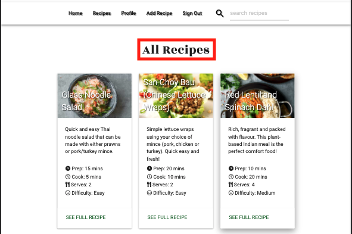

# Recipe Box

Hungry? [Recipe Box]() has you covered! 

## **Site Goals**

This project is part of my [Code Institute](https://codeinstitute.net/) Full Stack Software Development Diploma, specifically for the **Data Centric Development** Module. The objective of this project is to "build a full-stack site that allows users to manage a common dataset about a particular domain" using **CRUD** operations - **C**reate, **R**ead, **U**pdate and **D**elete.

I love to cook and have various recipes all over the place (in folders or books around the kitchen, saved online, printed, in emails etc) most of which I have modified in some way. Creating this project is a great way to finally store all these recipes in one place in a way that can easily be shared with others. It also allows other users to share and store recipes securely.

The site has been designed to be mobile first and easily accessible and responsive on a range of devices. This is to allow users to easily look up recipes on any device, wherever they are.

If the site is successful and generates interest and traffic, there is scope to substantially increase the scale of the site, it is anticipated that the site could be expanded to include the following features:

- Add a way for users to like/favourite a recipe, which will then save it to their profile page
- Add a way for users to rate recipes, with a star rating system
- Add a way for users to be able to comment on recipes
- Add ability for users to generate an easily printable version of a recipe
- Add a way for users to easily be able to share recipes on social media or via email

## **UX**

### User Stories

**As a user, I would like to:**

- [x] Access the site from mobile, tablet and desktop devices.
- [x] Easily register to have my own profile   

- [x] Easily log in to my profile   

- [x] Easily log out of my profile   

- [x] Receive feedback when I Log In   

- [x] Receive feedback when I Log Out    

- [x] Be able to browse all recipes submitted to the website   

- [x] Search recipes by ingredient, name or category   

- [x] Add my own recipes   

- [x] Edit my own recipes   

- [x] Delete my own recipes   

- [x] Be given feedback when I have added, edited, or deleted a recipe   

- [x] Have easy access to the recipes I have personally submitted   

**As an admin I would like to do all of the above and additionally:**

- [x] Access, edit and delete ALL recipes   

### Developer goals

* Create a easy to use, online cookbook where users can utilise CRUD (Create, Read, Update, Delete) functionality to  post, view, edit and delete recipies
* Allow only the owner of the recipe or an admin/superuser the ability to edit or delete a recipe.
* Provide users with the ability to search recipes by name, ingredient or tag.
* Further develop understanding of Python, Flask, Jinja & MongoDB (non-relational database).
* Improve knowledge of HTML, CSS & JavaScript.
* Use Materialize CSS to develop a website.
* Use Heroku to deploy the app.

### Wireframes

### Design

The site takes inspiration form similar sites such as [BBC Good Food](https://www.bbcgoodfood.com/), [Olive Magazine](https://www.olivemagazine.com/) and [Delicious Magazine](https://www.deliciousmagazine.co.uk/). The aim was to keep the site asthetic clean and simple to provide a positive UX and keep the focal point on the food and ensure recipe instrutions are clear and easy to follow.

#### Colour Scheme

Dark green (#1b5e20), black (#00000) and white (#fffff) were the 3 colours used throughout the site. These colours were chosen as they complement each other well and create a clean UI.

### Typography

Sonsie One and Rozha One were the two fonts used in the brand logo as they complement each other well. 

Rozha One was used throughout the site for page headings and sub-headings as it is a bold font, is clear to read, and ties the headings in nicely with the branding of the site.

Roboto was used for the main text of the site as it is very clear and legible. This font was used for the main blocks of text as it is very easy to read.

### Imagery

The imagery used throught the site have been taken from a range of online recipe sites, futher details and links can be found in the Acknowlegements section below.

## Features

### Consistent Site Features and Components

- All pages of the site contain the same **Header** and **Footer** components.

- **Header** 
    - The Header consists of the site logo in the center of the page, with the navbar menu items situated underneath it.

    - The navigation menu (situated beneath the site logo on all pages), was built using the Materialize CSS **Navbar** component It consists of the following menu items (aligned left).   
        - **If no user signed in:**  Home, Recipes, Sign In, Register   

        - **If User Signed in:** Home, Recipes, Profile, Add Recipe, Sign Out

    - Aligned to the right of the navigation menu is a search bar that allows users to search for recipes by name, ingredient or tag.

    - The navigation menu is condensed into a hamburger icon on tablet devices and smaller to provide positive UX and not overcrowd the UI.

- **Footer**
    - The footer consists of a newletter signup button that launches a modal containing the signup form and links to Recipe Box social media (note that as Recipe Box is for eductional purposes only and therefore does not have social media, the links redirect to the specific platform home page)

    - Below this, the site copyright information is displayed

### Home Page (available to all users, no need to register account)

- The **Home Page** features 6 Materialize cards displaying the top 6 recipes based on user views. Each time a user clicks on a recipe  card to view the full recipe, a view is added to the DB and the recipes with the most views are rendered on the page.

- Below the top 6 recipes is a "MORE RECIPES HERE" button that redirects the user to the Recipes Page, which features all recipes stored on the site (see below).

### Recipes Page (available to all users, no need to register account)

- The **Recipes Page** displays Materialize cards featuring all recipes on the site. This section features pagination to display 6 recipes per page. 

- The Materialize cards feature The following recipe information:

    - An image of the recipe
    - The recipe name/title
    - The recipe description
    - The recipe prep time
    - The recipe cook time
    - The recipe servings
    - The recipe difficulty
    - A link to view the full recipe

- The pagination is designed to only show the left chevron when the page is greater than 1 and the right chevron when on any page except the last. The active page is also made clear to th user so they can easily see which page they are currently viewing.

### Recipe Page (available to all users, no need to register account)

- Once a user clicks the **"SEE FULL RECIPE"** link at the bottom of a recipe card, the **Recipe Page** is launched to display the full recipe instructions.

- The page features the following recipe information:

    - An image of the recipe
    - The recipe name/title
    - The recipe description
    - The recipe prep time
    - The recipe cook time
    - The recipe servings
    - The recipe difficulty
    - If the user in session created the recipe or the admin user is logged in, **EDIT** and **DELETE** buttons are displayed to allow the user/admin to either edit or delete the recipe (these links will be covered in further detail below).
    - The recipe instructions
    - The recipe method

### Sign In Page (available to all users, no need to register account)

- The **Sign In** page features a form, handled by [WTForms](https://wtforms.readthedocs.io/en/2.3.x/) (covered in further detail below) and styled using [Materialize CSS](https://materializecss.com/).

- The form features a **Username** field (WTForms StringField), a **Password** field (WTForms PasswordField) and a **Sign In** button (WTForms SubmitField).

- The form checks the username/password combination and will redirect to the Sign In page if they do not match a document from the **users collection** in the DB, a flash message is also displayed to provide feedback to the user: "Invalid username/password combination. Please try again."

- If the user does not have an account, there is a link below the Sign In button to take them to the **Register Page**.

- After successful registration, the user is redirected to thier profile page and a flash message is displayed to welcome them to the site: "Welcome, \<username>".

### Register Page (available to all users, no need to register account)

- The **Register Page** features a form, handled by [WTForms](https://wtforms.readthedocs.io/en/2.3.x/) (covered in further detail below) and styled using [Materialize CSS](https://materializecss.com/).

- The form features a **Username** field (WTForms StringField), a **Password** field (WTForms PasswordField), A **Repeat Password** field (WTForms PasswordField), and a **Register** button (WTForms SubmitField).

- The form checks if the username already exists in the DB and if it does, will redirect back to the Register page and flash a message to the user to provide feedback: "Sorry, that username is already taken. Please try another".

- The form uses WTForms to check if the passwords match and if they don't will display an error message to the user: "Passwords do not match, please try again".

- If the user already has an account, there is a link below the Register button to take them to the **Sign In Page**. 

- After successful registration, the user is redirected to thier profile page and a flash message is displayed to welcome them to the site: "Welcome, \<username>".

### Profile Page (Only available to registered users)

- Upon successful loggin, the user is directed to their **Profile Page**.

- On loggin, there is a flash message displayed on the profile page to welcome the user to the site: "Welcome, \<username>".

- The Profile Page features a page heading "\<username>'s Recipe Box" with a sub-heading "Your Recipes..."

- Below these headings Materialize cards displaying the recipes submitted by the user in session (same layout as described in "Recipes Page" section above).

### Add Recipe Page (Only available to registered users)

- The **Add Recipe Page** features a form, handled by [WTForms](https://wtforms.readthedocs.io/en/2.3.x/) (covered in further detail below) and styled using [Materialize CSS](https://materializecss.com/).

- The form features the following fields:
    - **Recipe Name**: WTForms StringField
    - **Recipe Description**: WTForms TextAreaField
    - **Prep Time**: WTForms StringField
    - **Cook Time**: WTForms StringField
    - **Servings**: WTForms SelectField
    - **Tags**: WTForms StringField
    - **Difficulty**: WTForms SelectField
    - **Image Link**: WTForms StringField
    - **Ingredients**: WTForms TextAreaField
    - **Method**: WTForms TextAreaField

- The validation of all fields is handled by [WTForms Built-in Validators](https://wtforms.readthedocs.io/en/2.3.x/validators/#built-in-validators) and error messages are displayed to the user if ther input does not meet the field criteria.