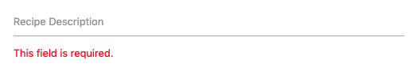
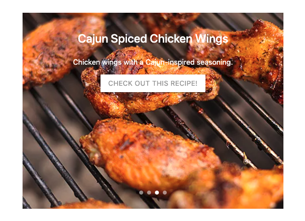
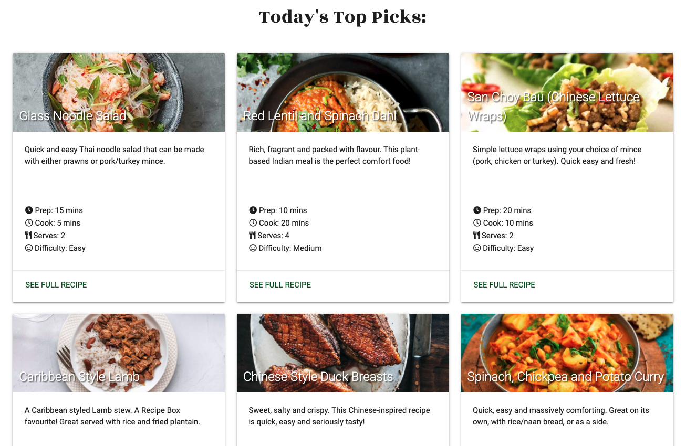
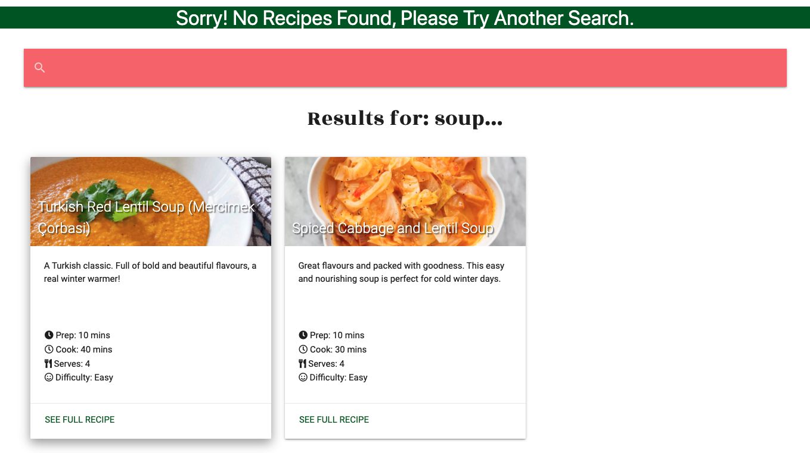
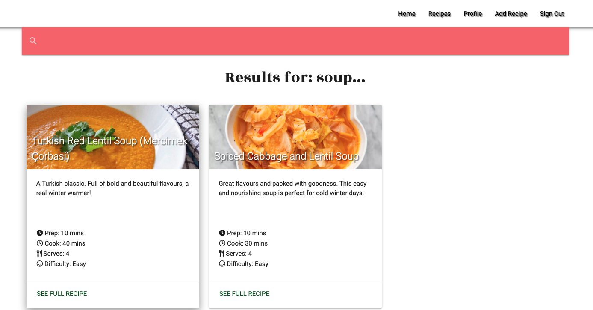
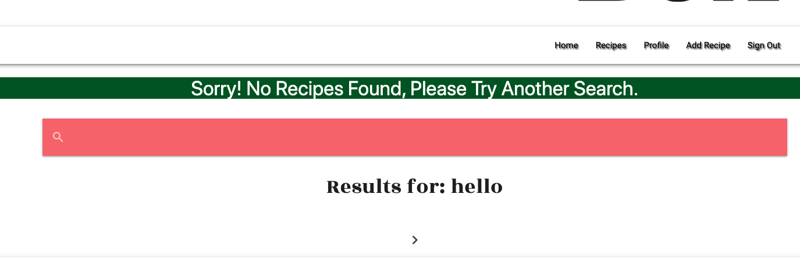
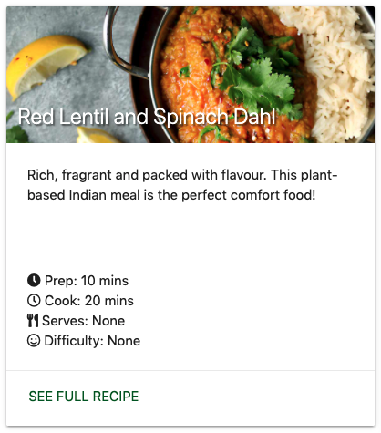

# Testing

## User Stories

The user stories are annotated below to describe funtionality and highlight the way in which the project fulfills the objectives set out. Relevant screenshots relating to each of the user stories below can be found in the main [README.md](https://github.com/theopmw/recipe-box) file.

* **Access the site from mobile, tablet and desktop devices**

    - [x] Materialize CSS has been used throughout the site to ensure all pages render correctly on all devices. This has been tested on a wide range of devices to ensure the UX is consistent, the site is reponsive at all sizes and the application behaves as expected.   

* **Easily register to have my own profile**

    - [x] The Register Page is clearly visible on the navigation menu, there is no user in session (on all devices).

    - [x] The form will check that the username is unique and is not already registered in the DB. If it isn't, an error message will be displayed to the user: "Sorry, that username is already taken. Please try another"

    - [x] If the username is unique, the form will check if passwords match. If they don't, an error message will be displayed to the user: "Passwords do not match, please try again"

    - [x] If there are no errors the user account will be set up, credentials added to the DB and the user will be redirected to their profile page and flash message will be dispayed: "Registration Successful!".

    - [x] If the user is alrady registered there is a link beneath the form to redirect them to the Sign In Page.

* **Easily log in to my profile**

    - [x] The Sign In Page is clearly visible on the navigation menu, there is no user in session  (on all devices).

    - [x] If the user inputs login credentials that do not match with any stored in the DB, the form will clear and a flash message will display: "Invalid username/password combination. Please try again.".
        * This has been done to not give away whether the user has input partially correct credentials, to improve defensive programming and stop a user potentially forcing their way into the site with another users login credentials.
    
    - [x] Once logged in and a registered user is in session, they will have access to the Profile, Add Recipe, and Sign Out buttons on the navigation menu.

    - [x] If the user is does not have an account registered, there is a link beneath the form to redirect them to the Register Page.

* **Easily log out of my profile**

    - [x] When a registered user is in session, the Sign Out menu item is displayed in the navigation menu. On user click, they are logged out, redirected to the Sign In page and a flash message is displayed: "You have been logged out".

    - [x] Once logged out and no registered user is in session, the Profile, Add Recipe, and Sign Out buttons are hidden on the navigation menu and the Sign In and Register buttons are available to allow users to register an account or log in if they have created one previously.
    

* **Receive feedback when I log in**

    - [x] When a registered user has sucessfully logged in, they are redirected to their profile page and a flash message will display: "Welcome, ``<username>``".

* **Receive feedback when I log out**

    - [x] When a registered user clicks the Sign Out button in the navigation menu, they are redirected to the sign in page and a flash message will display: "You have been logged out".

* **Be able to browse all recipes submitted to the website**

    - [x] The Recipes page is available to all users, whether registered or not, and is easily accessible from the navigation menu from all pages.
    - [x] Each recipe card has a link to the full recipe, situated at the bottom of the specific card.

* **Search recipes by ingredient, name or category**

    - [x] The search bar is clearly visible to the right of the navigation menu on desktop and at the bottom of the collapsible navigation menu on tablet and mobile devices.

    - [x] The search functionality will take a query that includes any part of the recipe name, tag or ingredient.

* **Add my own recipes**

    - [x] When in session, a registered user has access to the Add Recipe Page.

    - [x] The Create Recipe form has been designed to be as intuitive and user-fiendly as possible and provides feeback if errors are made by the user.

    - [x] Once sucessfully submitted, the user is redirected to thier profile and a flash message is dispalyed: "Recipe Added Successfully!".

* **Edit my own recipes**

    - [x] From the Recipe Page, the user can click the edit button, situated beneath the recipe information to edit their recipe (only available to the owner of the recipe or the admin user).

    - [x] The Edit Recipe form will then be rendered and pre-loaded with the recipe content.

    - [x] The user can then make any ammendments they want and click the "UPDATE RECIPE" button to  submit their changes, or click the "CANCEL" button to be redirected to their profile.

* **Delete my own recipes**

    - [x] From the Recipe Page, the user can click the delete button, situated beneath the recipe information, to delete their recipe (only available to the owner of the recipe or the admin user).

    - [x] This will redirect the user to the delete Recipe Page, the name of the recipe is displayed, followed by a message informing the user that this action cannot be undone. The user can then click the "DELETE RECIPE" button to permanantly delete the recipe, or click the "CANCEL" button to be returned to their profile.

* **Be given feedback when I have added, edited, or deleted a recipe**

    - [x] The following feedback by way of flash messages after the below actions are performed:

        * Add Recipe: "Recipe Added Successfully!"

        * Edit Recipe: "Recipe Updated Successfully!"

        * Delete Recipe: "Recipe Deleted Sucessfully!"

 
* **Have easy access to the recipes I have personally submitted**

    - [x] Each individual useres recipies are clearly displyed on their profile page.

* **(ADMIN ONLY) Access, edit and delete ALL recipes**

    - [x] The admibn user is able to access the "EDIT" and "DELETE" recipe buttons on all recipes submitted to the site.

## Manual Testing

### Navigation menu

- [x] Test all navigation menu items wok on all screensizes.

- [x] Log in and out and check correct navigation menu items are shown.

### Footer

- [x] Test footer social links, all open in new tab.

### Search

- [x] Search a recipe by name,tag or ingredient or a combinbation.

- [x] Perform a search that yeilds no results and check for flash message: " Sorry! No Recipes Found, Please Try Another Search."

### Home Page

- [x] Test Home Page displays top 6 viewed recipes and all links to recipes are working correctly.

- [x] Test "MORE RECIPES HERE" button redirects to Recipes Page and all recipes are displayed.

### Register Page

- [x] Attempt to register with empty form input fields, a "Please fill in this field" tooltip is displayed.

- [x] Attempt to register with 2 passwords that don't match, a "Passwords do not match, please try again" error message is displayed.

- [x] Attempt to register with a username or password that is too long or too short, a "Field must be between x and y characters long." error message is displayed.

- [x] Attempt to register with a username that already exists in the DB, a flash message "Sorry, that username is already taken. Please try another" is displayed.

- [x] Register with a unique username and matching passwords, user is redirected to their profile page and a flash message "Registration Successful!" is displayed.

- [x] Click "Already Registered? Log In" link, user is redirected to Sign In page.

### Sign In Page

- [x] Attempt to sign in with empty form input fields, a "Please fill in this field" tooltip is displayed.

- [x] Attempt to sign in with incorrect credentials, a flash message "Invalid username/password combination. Please try again" is displayed.

- [x] Sign in with valid credentials, user redirected to profile page and "Welcome, \<username>" flash message displayed.

- [x] Click "New Here? Register Account" link, user is redirected to Register page.

### Profile Page

- [x] Test all user recipes are dispayed correctly and links work as expected.

- [x] Test pagination works correctly.

## Recipes Page

- [x] Test all recipes render correctly and links work as expected.

- [x] Test pagination works correctly.

## Recipe Page

- [x] Test page renders correctly.

- [x] Test "EDIT"/"DELETE" buttons are only availabe to recipe owner/admin user and link to the correct pages.

## Create Recipe Page

- [x] Attempt to add a recipe with empty form input fields, a "Please fill in this field" tooltip is displayed.

- [x] Attempt to submit a recipe with a field that is too long or too short, a "Field must be between x and y characters long." error message is displayed.

- [ ] Attempt to submit a form with empty select field, form will be submitted and select field values will be set to "None". This is due to the way WTForms handles select fields and could not currently be avoided. A fix will be researched and implemented at a later date.
 
- [x] Submit a fully filled out form, user is redirected to their profile page and the recipe is added to the DB.

## Edit Recipe Page

- [x] Test thaht when edit recipe button is clicked, form is preloaded with all information from DB.

- [x] Clear fields and check for "Please fill in this field" tooltip.

- [x] Attempt to submit a recipe with a field that is too long or too short, a "Field must be between x and y characters long." error message is displayed.

- [x] Submit a form with edits made and check changes have been made and are displayed correctly.

- [x] Click cancel button and confirm user is returned to profile page.

## Delete Recipe Page

- [x] Confirm recipe name is displayed correctly.

- [x] Test delete button and confirm recipe has been deleted.

- [x] Test cancel button and confirm user is returmed to profile page.


## Error Pages

- [x] Force 404/500 errors and test pages are rendered correctly.

- [x] Test "Take me home!" link returns user to the Home Page.

## Automated Testing

The following automated tools/linters were used to test the project code throughout the development process:

### W3C Markup Validation (HTML)

* Only warnings/errors displayed by [W3C Markup Validation Service](https://validator.w3.org/) relate to the use of Jinja throughout .html files.

### W3C CSS Validation (CSS)

* No errors or warnings were found when the styles.css file was tested using the [W3C CSS Validation Service](https://jigsaw.w3.org/css-validator/).

### JSHint (JavaScript)

[JSHint](https://jshint.com/) was used to JavaScript files, no errors or warnings were found.

## Bugs

- ### ```<textarea>``` inputs not working correctly in create_recipe.html

Expected:  
When the **Create Recipe** form is filled out and the submit button clicked, the user is redirected to their profile page, the recipe is added to the recipes collection in MongoDB, is visible on the recipes.html page and it's own recipe.html page is generated.

Testing:  
The form was completely filled out and the **Add Recipe** button was clicked.

Result:  
"This field is required" errors were flagged under each of the ```<textarea>``` form elements and the form was not validated and submitted. See screenshot below for example of error:



Fix:  
For the ```<textarea>``` elements, only the label was being provided and not the actual form fields. The form fields also had to then have the extra attributes added for them to render correctly. The original ```<textarea>```  in the "Before" code snippet below was not part of the actual form so when the form was submitted, the form didn't actually have anything to read from those fields - because they didn't belong to the form. These errors were corrected, as is illustrated in the "After" code snippet below.


Below are the changes made to each of the 3 ```<textarea>``` elements to fix the bug:

create_recipe.html code snippet (before):
```
<!-- recipe description -->
    <div class="row">
        <div class="col s10 offset-s1 m8 offset-m2 input-field">
            <textarea id="create-description" class="materialize-textarea"></textarea>
            {{ form.description.label }}
            
            <span style="color: red;">{{ error }}</span>
            
        </div>
    </div>

<!-- ingredients -->
    <div class="row">
        <div class="col s10 offset-s1 m8 offset-m2 input-field">
            <textarea id="create-ingredients" class="materialize-textarea"></textarea>
            {{ form.ingredients.label }}
            
            <span style="color: red;">{{ error }}</span>
            
        </div>
    </div>

    <!-- method -->
    <div class="row">
        <div class="col s10 offset-s1 m8 offset-m2 input-field">
            <textarea id="create-method" class="materialize-textarea"></textarea>
            {{ form.method.label }}
            
            <span style="color: red;">{{ error }}</span>
            
        </div>
    </div>

```

create_recipe.html code snippet (after):

```
<!-- recipe name -->
    <div class="row">
        <div class="col s10 offset-s1 m8 offset-m2 input-field">
            {{ form.recipe_name.label }}
            {{ form.recipe_name(size=32) }}
            
            <span style="color: red;">{{ error }}</span>
            
        </div>
    </div>

<!-- ingredients -->
    <div class="row">
        <div class="col s10 offset-s1 m8 offset-m2 input-field">
            {{ form.ingredients.label }}
            {{ form.ingredients(cols="60", rows="8", id="create-ingredients", class="materialize-textarea")}}
            
            <span style="color: red;">{{ error }}</span>
            
        </div>
    </div>

    <!-- method -->
    <div class="row">
        <div class="col s10 offset-s1 m8 offset-m2 input-field">
            {{ form.method.label }}
            {{ form.method(cols="60", rows="8", id="create-method", class="materialize-textarea")}}
            
            <span style="color: red;">{{ error }}</span>
            
        </div>
    </div>

```

- ###  Top 4 recipes not pulling into index.html carousel from DB correctly

Expected:  
The @app.route for index.html pulls the top 4 most viewed recipes from the DB to then be displayed in a Materialize carousel on the home page.
  
Testing:   
Used the Mongo ```sort()``` and ```limit()``` methods to sort the documents in the recipes collection by the property stored in the views field and limit them to the top 4 results. As a test, these were then printed to the terminal using ```print(list(top_four_recipes))```, this worked correctly so the correct information was being read from the Mongo DB. Then tried to loop over these in the index.html template in order to render them on the page as part of the Materialize carousel.

app.py code snippet:
```
@app.route("/")
@app.route("/index")
def index():
    """Home page pulls 4 most viewed recipes from DB"""
    top_four_recipes = list(
        mongo.db.recipes.find().sort([('views', DESCENDING)]).limit(4))
    return render_template(
        'index.html', recipes=recipes)
```
index.html code snippet:
```
<div class="carousel carousel-slider center">
    
        <div class="carousel-item red white-text" href="#one!">
            <h2>{{ recipes.recipe_name }}</h2>
            <p class="white-text">{{ recipe.description }}</p>
            <a class="btn waves-effect white grey-text darken-text-2" href="{{ url_for('recipe', recipe_id=recipe._id) }}">Check out this recipe!</a>
        </div>
    
</div>
```
Result:   
The carrousel did not render correctly and the DB data was not being pulled into the carousel.

Fix:   
To solve this, the recipes were refered to by index and these were used to pull the correct data into the index.html carousel.

app.py code snippet:
```
@app.route("/")
@app.route("/index")
def index():
    """Home page pulls 4 most viewed recipes from DB"""
    top_four_recipes = list(
        mongo.db.recipes.find().sort([('views', DESCENDING)]).limit(4))

    recipes = [
        top_four_recipes[0],
        top_four_recipes[1],
        top_four_recipes[2],
        top_four_recipes[3],
    ]

    return render_template(
        'index.html', recipes=recipes)
```

index.html code snippet:
```
<div class="carousel carousel-slider center">
    <div class="carousel-item white-text" href="">
        <h2>{{ recipes[0].recipe_name }}</h2>
        <p class="white-text">{{ recipes[0].description }}</p>
        <a class="btn waves-effect white grey-text darken-text-2" href="{{ url_for('recipe', recipe_id=recipes[0]._id) }}">Check out this recipe!</a>
        
    </div>
    <div class="carousel-item white-text" href="#two!">
        <h2>{{ recipes[1].recipe_name }}</h2>
        <p class="white-text">{{ recipes[1].description }}</p>
        <a class="btn waves-effect white grey-text darken-text-2" href="{{ url_for('recipe', recipe_id=recipes[1]._id) }}">Check out this recipe!</a>
        
    </div>
    <div class="carousel-item white-text" href="#three!">
        <h2>{{ recipes[2].recipe_name }}</h2>
        <p class="white-text">{{ recipes[2].description }}</p>
        <a class="btn waves-effect white grey-text darken-text-2" href="{{ url_for('recipe', recipe_id=recipes[2]._id) }}">Check out this recipe!</a>
        
    </div>
    <div class="carousel-item white-text" href="#four!">
        <h2>{{ recipes[3].recipe_name }}</h2>
        <p class="white-text">{{ recipes[3].description }}</p>
        <a class="btn waves-effect white grey-text darken-text-2" href="{{ url_for('recipe', recipe_id=recipes[3]._id) }}">Check out this recipe!</a>
        
    </div>
</div>
```

Below is a screenshot, after some CSS styling (not yet complete). To illustrate how the carousel was rendered on the index.html page:



Notes:   
The carousel was replaced with Materialize cards to display the top 6 viewed recipes on the site. This was done to improve the UX and link the Home page in with the design style used throughout the rest of the site. The code was refactored since the orignal code pulled the recipes as a dictionary, converted them to a list, then back to a dictionary. The final code for home page cards is displayed below:

app.py index route snippet:

```
@app.route("/")
@app.route("/index")
def index():
    """Home page pulls 6 most viewed recipes from DB"""
    top_six_recipes = mongo.db.recipes.find().sort([('views', DESCENDING)]).limit(6)

    return render_template(
        'index.html', recipes=top_six_recipes)
```

index.html template snippet:
```
<div class="row font-roboto">
    
    <div class="col s12 m6 l4">
        
        <div class="card hoverable">
            <div class="card-image recipe-card-image-container">
                <!-- Recipe Image -->
                
                <!-- Recipe Name -->
                <span class="card-title white-text text-shadow">{{ recipe.recipe_name }}</span>
            </div>
            <div class="card-content">
                <div class="recipe-card-description">
                    <!-- Recipe description -->
                    <p>{{ recipe.description }}</p>
                </div>
                <br>
                <div class="recipe-card-info">
                    <div class="recipe-card-time">
                        <!-- Recipe prep time -->
                        <p><i class="fas fa-clock"></i> Prep: {{ recipe.prep_time }} mins</p>
                        <!-- Recipe cook time -->
                        <p><i class="far fa-clock"></i> Cook: {{ recipe.cook_time }} mins</p>
                    </div>
                    <div class="recipe-card-serves">
                        <!-- Recipe servings -->
                        <p><i class="fas fa-utensils"></i> Serves: {{ recipe.serves }}</p>
                    </div>
                    <div class="recipe-card-difficulty">
                        <!-- Recipe difficulty -->
                        <p><i class="far fa-smile"></i> Difficulty: {{ recipe.difficulty }}</p>
                    </div>
                </div>
            </div>
            <div class="card-action">
                <!-- Link to full recipe -->
                <a class="green-text text-darken-4 link" href="{{ url_for('recipe', recipe_id=recipe._id) }}">See full
                    recipe</a>
            </div>
        </div>
        
    </div>
    
</div>
```

Final index.html page screenshot (with top 6 cards instead of top 4 carousel):




- ### Search flash message displayed whether there are mutiple results or 0

Expected:   
If 0 results are returned when a user submits a search query, a flash message is displayed to tell them that there are no matches for their search and to search again. If there are search results, there is no flash message and the results are displayed.

Testing:  
Try seaching for items that exist and dont exist to test whether the search functionality is working correctly.

Result:    
The flash message is displayed even when there are search results that match a users search query. 

app.py search route snippet:

```
@app.route('/search', methods=['GET', 'POST'])
def search():
    """Logic for recipe search"""
    # Pull query from the form
    orig_query = request.form.get("query", "")

    # using regular expression setting option for any case
    query = {
        '$regex': re.compile('.*{}.*'.format(orig_query), re.IGNORECASE)}

    # find instances of the entered word in
    # recipe_name, tags or ingredients documents
    results = mongo.db.recipes.find({
        '$or': [
            {'recipe_name': query},
            {'tags': query},
            {'ingredients': query},
        ]
    })

    # Count number of search results found
    results_total = mongo.db.recipe.find({
        '$or': [
            {'recipe_name': query},
            {'tags': query},
            {'ingredients': query},
        ]
    }).count()

    if results_total > 0:
        return render_template(
            'search.html', query=orig_query, results=results, page=1)
    else:
        flash('Sorry! No Recipes Found, Please Try Another Search.')
        return render_template(
            'search.html', query=orig_query, results=results, page=1)

```


With the above code, the flash message is displayed even when there are results relvant to the users search query:



Fix:   
The issue came from a typo when assigning the results_total variable, since it was not correctly referencing ```mongo.db.recipes```. Rather, it was referencing ```mongo.db.recipe```. The route could also be further simplified by performing the count using ```results_num = results.count()```. This syntax is both cleaner, and requires 1 less DB query.

app.py search route snippet:
```
@app.route('/search', methods=['GET', 'POST'])
def search():
    """Logic for recipe search"""
    # Pull query from the form
    orig_query = request.form.get("query", "")

    # using regular expression setting option for any case
    query = {
        '$regex': re.compile('.*{}.*'.format(orig_query), re.IGNORECASE)}

    # find instances of the entered word in
    # recipe_name, tags or ingredients documents
    results = mongo.db.recipes.find({
        '$or': [
            {'recipe_name': query},
            {'tags': query},
            {'ingredients': query},
        ]
    })

    # Count number of search results found
    results_total = results.count()

    if results_total > 0:
        return render_template(
            'search.html', query=orig_query, results=results, page=1)
    else:
        flash('Sorry! No Recipes Found, Please Try Another Search.')
        return render_template(
            'search.html', query=orig_query, results=results, page=1)
```

The flash message is now only displayed when there are 0 result found for the users search query:



- ### Chevrons displayed when there are no search results

Expected:    
When a user search yeilds no search results, no chevrons are shown.

Testing:    
Submit a search into the search form.

Results:    
When the user submits a seach, the next page chevron is still displayed.



Fix:    
Add an additional if statement (that wraps the full code for pagination) that will essentially disable pagination, including the chevrons, if total == 0.

search.html code snippet:
```

<!-- Pagination -->
<!-- Credit: code for pagination modified from code supplied by my Code Institute mentor: Spencer Barriball --> 
<div class="pagination-container font-roboto">
  <ul class="pagination center-align">
    <!-- If page 1, hide left chevron -->
    
    <li class="hide"><a href="{{ url_for('search', query=query, page=page-1) }}"><i class="material-icons">chevron_left</i></a></li>
    <!-- If page > 1, show left chevron and on click decrease page by 1 -->
    
    <li class="waves-effect"><a href="{{ url_for('search', query=query, page=page-1) }}"><i class="material-icons">chevron_left</i></a></li>
    
      
        <!-- If page is current page, display page as active -->
        
          <li class="active white">
            <span>{{ pagenum }}
              <span class="sr-only">(current)</span>
            </span>
          </li>
        
          <!-- If page not current page, allow user to click -->
          <li class="waves-effect white"><a href="{{ url_for('search', query=query, page=pagenum) }}">{{ pagenum }}</a></li>
        
      
    
      <!-- If last page, hide right chevron -->
      <li class="hide"><a href="{{ url_for('search', query=query, page=page+1) }}"><i class="material-icons">chevron_right</i></a></li>
    
      <!-- If last page, show right chevron and on click increase page by 1 -->
      <li class="waves-effect"><a href="{{ url_for('search', query=query, page=page+1) }}"><i class="material-icons">chevron_right</i></a></li>
      
  </ul>
</div>


```

## Known Bugs and Issues

### Select Fields can me left blank and display "None" when page renders

Due to the way Flask-WTForms manages select fields, the user is able to leave the "Serves" and "Dificulty" select fields blank. This will need to be researched and corrected at a later date. Although it does not drastically affect the UX, it could be improved.

