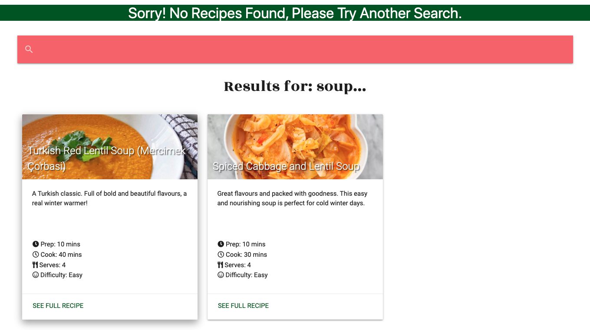

## Bugs
---

- ### ```<textarea>``` inputs not working correctly in create_recipe.html

Expected:  
When the **Create Recipe** form is filled out and the submit button clicked, the user is redirected to their profile page, the recipe is added to the recipes collection in MongoDB, is visible on the recipes.html page and it's own recipe.html page is generated.

Testing:  
The form was completely filled out and the **Add Recipe** button was clicked.

Result:  
"This field is required" errors were flagged under each of the ```<textarea>``` form elements and the form was not validated and submitted. See screenshot below for example of error:


Fix:  
For the ```<textarea>``` elements, only the label was being provided and not the actual form fields. The form fields also had to then have the extra attributes added for them to render correctly. The original ```<textarea>```  in the "Before" code snippet below was not part of the actual form so when the form was submitted, the form didn't actually have anything to read from those fields - because they didn't belong to the form. These errors were corrected, as is illustrated in the "After" code snippet below.


Below are the changes made to each of the 3 ```<textarea>``` elements to fix the bug:

create_recipe.html code snippet (before):
```
<!-- recipe description -->
    <div class="row">
        <div class="col s10 offset-s1 m8 offset-m2 input-field">
            <textarea id="create-description" class="materialize-textarea"></textarea>
            {{ form.description.label }}
            
            <span style="color: red;">{{ error }}</span>
            
        </div>
    </div>

<!-- ingredients -->
    <div class="row">
        <div class="col s10 offset-s1 m8 offset-m2 input-field">
            <textarea id="create-ingredients" class="materialize-textarea"></textarea>
            {{ form.ingredients.label }}
            
            <span style="color: red;">{{ error }}</span>
            
        </div>
    </div>

    <!-- method -->
    <div class="row">
        <div class="col s10 offset-s1 m8 offset-m2 input-field">
            <textarea id="create-method" class="materialize-textarea"></textarea>
            {{ form.method.label }}
            
            <span style="color: red;">{{ error }}</span>
            
        </div>
    </div>

```

create_recipe.html code snippet (after):

```
<!-- recipe name -->
    <div class="row">
        <div class="col s10 offset-s1 m8 offset-m2 input-field">
            {{ form.recipe_name.label }}
            {{ form.recipe_name(size=32) }}
            
            <span style="color: red;">{{ error }}</span>
            
        </div>
    </div>

<!-- ingredients -->
    <div class="row">
        <div class="col s10 offset-s1 m8 offset-m2 input-field">
            {{ form.ingredients.label }}
            {{ form.ingredients(cols="60", rows="8", id="create-ingredients", class="materialize-textarea")}}
            
            <span style="color: red;">{{ error }}</span>
            
        </div>
    </div>

    <!-- method -->
    <div class="row">
        <div class="col s10 offset-s1 m8 offset-m2 input-field">
            {{ form.method.label }}
            {{ form.method(cols="60", rows="8", id="create-method", class="materialize-textarea")}}
            
            <span style="color: red;">{{ error }}</span>
            
        </div>
    </div>

```

- ###  Top 4 recipes not pulling into index.html carousel from DB correctly

Expected:  
The @app.route for index.html pulls the top 4 most viewed recipes from the DB to then be displayed in a Materialize carousel on the home page.
  
Testing:   
Used the Mongo ```sort()``` and ```limit()``` methods to sort the documents in the recipes collection by the property stored in the views field and limit them to the top 4 results. As a test, these were then printed to the terminal using ```print(list(top_four_recipes))```, this worked correctly so the correct information was being read from the Mongo DB. Then tried to loop over these in the index.html template in order to render them on the page as part of the Materialize carousel.

app.py code snippet:
```
@app.route("/")
@app.route("/index")
def index():
    """Home page pulls 4 most viewed recipes from DB"""
    top_four_recipes = list(
        mongo.db.recipes.find().sort([('views', DESCENDING)]).limit(4))
    return render_template(
        'index.html', recipes=recipes)
```
index.html code snippet:
```
<div class="carousel carousel-slider center">
    
        <div class="carousel-item red white-text" href="#one!">
            <h2>{{ recipes.recipe_name }}</h2>
            <p class="white-text">{{ recipe.description }}</p>
            <a class="btn waves-effect white grey-text darken-text-2" href="{{ url_for('recipe', recipe_id=recipe._id) }}">Check out this recipe!</a>
        </div>
    
</div>
```
Result:   
The carrousel did not render correctly and the DB data was not being pulled into the carousel.

Fix:   
To solve this, the recipes were refered to by index and these were used to pull the correct data into the index.html carousel.

app.py code snippet:
```
@app.route("/")
@app.route("/index")
def index():
    """Home page pulls 4 most viewed recipes from DB"""
    top_four_recipes = list(
        mongo.db.recipes.find().sort([('views', DESCENDING)]).limit(4))

    recipes = [
        top_four_recipes[0],
        top_four_recipes[1],
        top_four_recipes[2],
        top_four_recipes[3],
    ]

    return render_template(
        'index.html', recipes=recipes)
```

index.html code snippet:
```
<div class="carousel carousel-slider center">
    <div class="carousel-item white-text" href="">
        <h2>{{ recipes[0].recipe_name }}</h2>
        <p class="white-text">{{ recipes[0].description }}</p>
        <a class="btn waves-effect white grey-text darken-text-2" href="{{ url_for('recipe', recipe_id=recipes[0]._id) }}">Check out this recipe!</a>
        
    </div>
    <div class="carousel-item white-text" href="#two!">
        <h2>{{ recipes[1].recipe_name }}</h2>
        <p class="white-text">{{ recipes[1].description }}</p>
        <a class="btn waves-effect white grey-text darken-text-2" href="{{ url_for('recipe', recipe_id=recipes[1]._id) }}">Check out this recipe!</a>
        
    </div>
    <div class="carousel-item white-text" href="#three!">
        <h2>{{ recipes[2].recipe_name }}</h2>
        <p class="white-text">{{ recipes[2].description }}</p>
        <a class="btn waves-effect white grey-text darken-text-2" href="{{ url_for('recipe', recipe_id=recipes[2]._id) }}">Check out this recipe!</a>
        
    </div>
    <div class="carousel-item white-text" href="#four!">
        <h2>{{ recipes[3].recipe_name }}</h2>
        <p class="white-text">{{ recipes[3].description }}</p>
        <a class="btn waves-effect white grey-text darken-text-2" href="{{ url_for('recipe', recipe_id=recipes[3]._id) }}">Check out this recipe!</a>
        
    </div>
</div>
```

Below is a screenshot, after some CSS styling (not yet complete). To illustrate how the carousel was rendered on the index.html page:


- ### Search flash message displayed whether there are mutiple results or 0

Expected:   
If 0 results sre returned when a user submits a search query, a flash message is displayed to tell them that there are no matches for there searcha nd to search again. If there are search results, there is no flash message and the results are displayed.

Testing:  
Try seaching for items that exist and dont exist to test whether the search functionality is working correctly.

Result:    
The flash message is displayed even when there are matched to the users search query. 

app.py search route snippet:

```
@app.route('/search', methods=['GET', 'POST'])
def search():
    """Logic for recipe search"""
    # Pull query from the form
    orig_query = request.form.get("query", "")

    # using regular expression setting option for any case
    query = {
        '$regex': re.compile('.*{}.*'.format(orig_query), re.IGNORECASE)}

    # find instances of the entered word in
    # recipe_name, tags or ingredients documents
    results = mongo.db.recipes.find({
        '$or': [
            {'recipe_name': query},
            {'tags': query},
            {'ingredients': query},
        ]
    })

    # Count number of search results found
    results_total = mongo.db.recipe.find({
        '$or': [
            {'recipe_name': query},
            {'tags': query},
            {'ingredients': query},
        ]
    }).count()

    if results_total > 0:
        return render_template(
            'search.html', query=orig_query, results=results, page=1)
    else:
        flash('Sorry! No Recipes Found, Please Try Another Search.')
        return render_template(
            'search.html', query=orig_query, results=results, page=1)

```

With the above code, the flash message is displayed even when there are results relvant to the users search query:



Fix:   
The issue came from a typo when assigning the results_total variable, since it was not correctly referencing ```mongo.db.recipes```. Rather, it was referencing ```mongo.db.recipe```. The route could also be further simplified by performing the count using ```results_num = results.count()```. This syntax is both cleaner, and requires 1 less DB query.

app.py search rout snippet:
```
@app.route('/search', methods=['GET', 'POST'])
def search():
    """Logic for recipe search"""
    # Pull query from the form
    orig_query = request.form.get("query", "")

    # using regular expression setting option for any case
    query = {
        '$regex': re.compile('.*{}.*'.format(orig_query), re.IGNORECASE)}

    # find instances of the entered word in
    # recipe_name, tags or ingredients documents
    results = mongo.db.recipes.find({
        '$or': [
            {'recipe_name': query},
            {'tags': query},
            {'ingredients': query},
        ]
    })

    # Count number of search results found
    results_total = results.count()

    if results_total > 0:
        return render_template(
            'search.html', query=orig_query, results=results, page=1)
    else:
        flash('Sorry! No Recipes Found, Please Try Another Search.')
        return render_template(
            'search.html', query=orig_query, results=results, page=1)
```

The flash message is now only displayed when there are 0 result found for the users search query:


